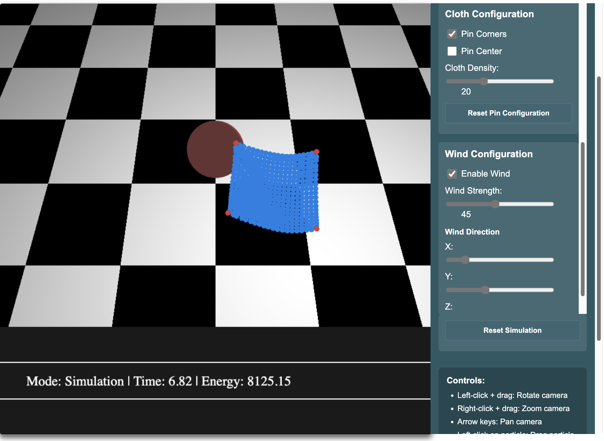
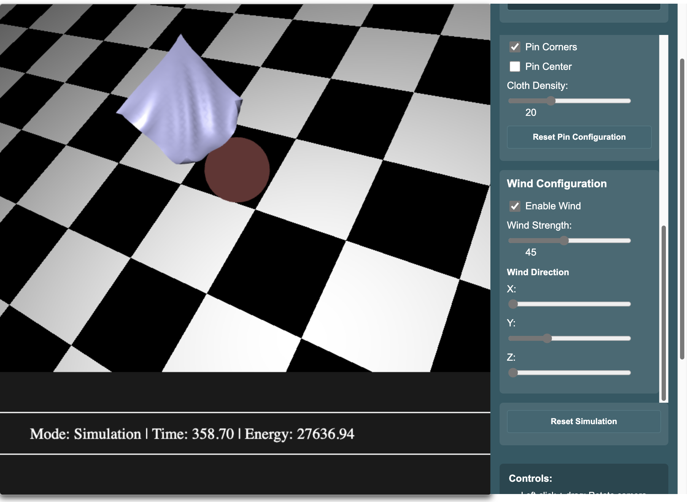

1. Ethan Chandra (ec42227), Alyssa Chan (awc894)
2. N/A
3. **Extra Credit**: Both partners working on this project affirm, on our honor, that we have completed and submitted the survey. 
4. **Project Details**

# Project Overview
This project implements a physically accurate cloth simulation using a mass-spring system. The simulation models different fabric types (cotton, silk, leather, and rubber) and includes interactions with physical objects. The system allows for realistic cloth draping, wind effects, and user interaction through a comprehensive UI.

# Features

 - **Physics-based simulation**: Accurate mass-spring system for cloth movement using Verlet integration

 - **Multiple fabric types**: Four preset material types with realistic physical properties

     - Cotton: Balanced stiffness and flexibility
     - Silk: Lightweight with elegant draping
     - Leather: Stiff and heavy material
     - Rubber: Elastic with high stretch factor

 - **Custom material properties**: Adjust all physical parameters independently

     - Structural stiffness
     - Shear stiffness
     - Bend stiffness
     - Damping
     - Mass
     - Stretch factor

 - **Collision detection**: Cloth interacts with spheres and the ground

 - **Interactive controls**:

     - Drag and pin cloth particles
     - Apply wind forces with adjustable direction and strength
     - Multiple visualization modes (shaded, wireframe, points, springs)

 - **Multiple Preset Tests**: Demos of the effects of the various features of the cloth simulation as well as a custom parameter test that allows you to adjust all the aspects of the simulation accordingly

 - **Skybox environment**: Procedurally generated sky and clouds

# How to Compile and Run
To complie and run this project it is the same as with the previous projects involving OpenGL.

1. Run **make-skinning.py**
2. Launch the HTTP server by running **http-server dist -c-1**

# Controls

 - Camera:
     - Left-click + drag: Rotate camera
     - Right-click + drag: Zoom camera
     - Arrow keys: Pan camera

 - Cloth interaction:
     - Left-click on particle: Drag particle
     - Shift + click: Pin/unpin particle

 - Keyboard shortcuts:
     - 'V': Cycle visualization modes
     - 'P': Pause/Play simulation
     - 'R': Reset simulation

# Custom Parameter Test
You can run a custom parameter test that allows you to adjust all the aspects of the simulation accordingly. 

 1. Navigate to the **Simulation Type** section and select **Custom Parameters**
 2. You can enable and change the properties of materials, cloth configuration, and wind configuration.

## Some unique features in "Custom Mode"
 - Let's say that you run the simulation by setting no pins and press "Reset Simulation" or "Reset Pin Configuration", while it is falling you can select "Pin Corners" or "Pin Center" and press "Reset Pin Configuration" while it is falling to catch it in the air. You can also do this manually by "Shift + clicking" on the cloth.

 - You can setup a situation where you enable "Pin Corners" remove 2 corners from one side by "Shift + clicking", creating a dagling cloth from a line. You can then enable the wind and see the effects of wind on a flat cloth. (Move the camera around to isolate the pinnned corner better so no other particles are interacting with it and you can unpin it easier.)

# Main Project Components

 - `Cloth.ts`: Core cloth simulation implementation
 - `Particle.ts`: Particle physics for the mass-spring system
 - `Spring.ts`: Spring connections between particles
 - `ClothAnimation.ts`: WebGL rendering and animation
 - `ClothGui.ts`: User interface and input handling
 - `ClothControls.ts`: UI controls for simulation parameters
 - `ClothShaders.ts`: WebGL shaders for cloth, springs, and skybox rendering

# Technical Implementation

The cloth is modeled as a grid of particles connected by springs of three types:

 1. Structural springs: Connect adjacent particles horizontally and vertically
 2. Shear springs: Connect particles diagonally to prevent shearing
 3. Bend springs: Connect particles two positions apart to control bending stiffness

The physics integration uses the Verlet method for stable simulation. Collision detection handles interactions with 3D objects, and wind forces are applied across the cloth surface.

# Known Limitations
 - High-resolution cloth simulations may cause performance issues on lower-end hardware
 - Extreme parameter values can lead to instability in the simulation (especially with high dampening and low particle mass)
 - Cloth self-collision is not implemented